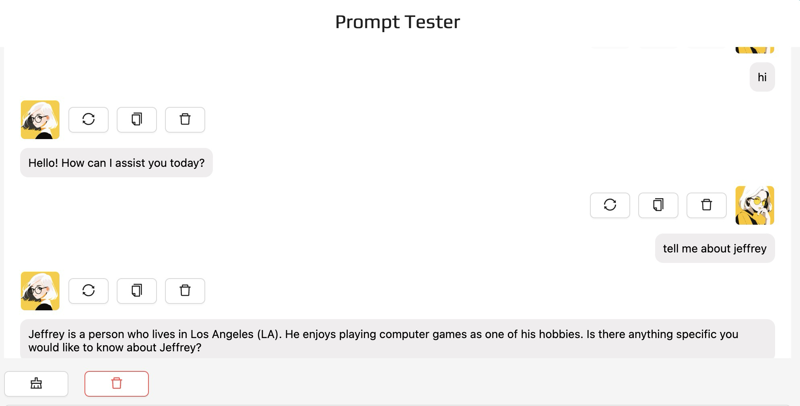
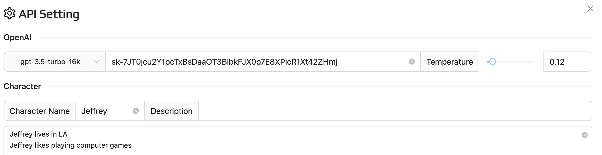

# Summary

## 1. Schedule
### 1.1 整理聊天记录

每个人整理两个2个助理的聊天记录

格式:

```python
AI: 内容
User: 聊天内容
# 非纯文本单独内容(图片，聊天表情，文件）使用[图片/表情/文件] 代替
# 非纯文本行内内容删除
```

每一天的聊天内容空行分隔开, 保存到 `data` 文件夹

如果可行的话可以写一个脚本处理更好

### 1.2 Prompt测试

访问 http://13.56.166.103/ (注意不是https) 可以在线测试prompt,不过还有很多bug可能用起来比较麻烦

用法:

```python
# 左下角API Setting选择模型并输入你的OpenAI Key，调节temperature
# 目前GPT-3.5-turbo有bug，选择别的模型就行

# 输入Character Name和Character的设定并在左下角Create Character

# 如果遇到bug，F12开发者工具->Application->Local Storage->Clear Local Storage->重新访问上面链接
# 目前删除Character时可能会遇到bug，后面我会修一下
```

Example:





建议把这本书第2-3章快速过一遍，更好的写prompt

https://weread.qq.com/book-detail?type=1&senderVid=6727677&v=4cc32520813ab8230g015373

### 1.3 开发日志

请根据 [日志模版](./Development/template.md) 在`Development`文件夹下创建日志文件夹

Example

```
├── Development
│   ├── Template.md
│   ├── Jeffrey You.md
│   ├── xxx.md
│   ├── xxx.md
```

### 1.4  熟悉项目

尝试配置一下环境运行一下，有问题随时找我

